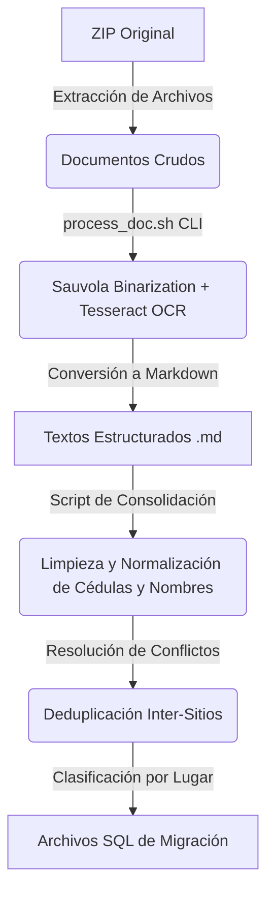

# Sistema de Consolidación y Migración de Datos — Terremoto Venezuela 2026

Este repositorio contiene los datos consolidados, limpios y estructurados de las personas afectadas (pacientes ingresados en centros médicos y refugiados) tras el terremoto en Venezuela de 2026. Los datos fueron recopilados de diversas fuentes civiles de emergencia y procesados para su integración segura en bases de datos relacionales.

Consulte el documento [DISCLAIMER.md](DISCLAIMER.md) para conocer los términos de responsabilidad y alineación con estándares internacionales de datos.

---

## 📂 Estructura del Repositorio

El repositorio está organizado de la siguiente manera:

```text
├── DISCLAIMER.md             # Descargo de responsabilidad y políticas de datos
├── README.md                 # Documentación general del repositorio
├── extracted_raw/            # Directorio con los textos en Markdown extraídos de las fuentes
│   ├── personas_sin_cedula.md # Reporte de registros pendientes de asignación de ID
│   └── SISMO 2026 VZLA /     # Carpetas con los archivos .md en el mismo orden que el ZIP original
│       ├── 01-LISTA DIGITALIZADA HOSPITALES/
│       ├── 02-LINK DE BUSQUEDA DE PERSONAS /
│       ├── HOSPITAL DE CATIA/
│       └── HOSPITAL PEREZ CARREÑO /
└── mysql_output/             # Scripts SQL separados por hospital o refugio (Listos para importar)
    ├── hospital_perez_carreno.sql
    ├── hospital_vargas_de_caracas.sql
    ├── hospital_dr_domingo_luciani.sql
    └── ... (15 archivos SQL en total)
```

---

## ⚙️ Flujo del Proceso de Tratamiento de Datos

El procesamiento y estructuración se realizó en cuatro etapas secuenciales:



### 1. Extracción y OCR (Reconocimiento Óptico)
- Se procesaron **88 imágenes de listas impresas** de pacientes mediante binarización adaptativa de **Sauvola** (para limpiar ruido de iluminación y sombras) y se ejecutó **Tesseract OCR** en paralelo.
- Los documentos `.pdf` y `.docx` (reportes consolidados) fueron convertidos a tablas legibles de Markdown utilizando el motor de conversión `bgustdown` de Rust.

### 2. Limpieza y Normalización de Datos
- **Cédula de Identidad (ID)**: Se extrajo el valor puramente numérico, removiendo prefijos (`V-`, `E-`, `V `, `E`) y caracteres de control (como paréntesis de cierre `)`). Se aplicó una validación estricta para asegurar que el ID tuviera entre 5 y 9 dígitos, descartando encabezados e información no documentada de la clave primaria.
- **Nombres**: Se eliminaron duplicados adyacentes presentes en los archivos de origen (por ejemplo, nombres repetidos en la columna apellido y nombre: `MARCANO ROSA MARCANO ROSA` -> `MARCANO ROSA`).
- **Estructura del Nombre**: Se convirtieron a mayúsculas sostenidas y se limpiaron espacios extras.
- **Lugares**: Se mapearon y estandarizaron más de 30 designaciones informales de centros de salud a **15 ubicaciones oficiales**.

### 3. Deduplicación y Resolución de Conflictos (Inter-Sitios)
Dado que una persona no puede estar registrada en dos centros médicos o refugios diferentes de forma simultánea, se aplicó una regla de negocio para la resolución de colisiones de cédula:
- **Regla de Prioridad**: `Hospital` > `Refugio`. Si una persona aparecía registrada en un hospital y un refugio a la vez, se conservó su registro médico en el hospital (actualizando su estado general) y se descartó del refugio temporal.
- **Registro de Conflictos**: Los cruces y duplicados corregidos se almacenaron localmente para su verificación física e histórica en el archivo `conflictos_cedula.json`.

### 4. Generación de Cargas SQL
Se generaron scripts individuales de importación SQL para cada uno de los 15 centros y refugios clasificados.

---

## 🛢️ Estructura de la Base de Datos (MySQL)

Cada archivo SQL crea (si no existe) e inserta los datos en una tabla llamada `personas` configurada con el juego de caracteres `latin1` y cotejamiento `latin1_swedish_ci` para soporte óptimo de caracteres en español y compatibilidad con sistemas legados:

```sql
CREATE TABLE IF NOT EXISTS personas (
    cedula VARCHAR(255) NOT NULL,
    nombre VARCHAR(255),
    estado VARCHAR(255),
    hospital_refugio VARCHAR(255),
    PRIMARY KEY (cedula)
) ENGINE=InnoDB DEFAULT CHARSET=latin1 COLLATE=latin1_swedish_ci;
```

### Definición de Estados (`estado`)
* **`encontrado`**: Persona identificada con vida en el centro asistencial o refugio.
* **`alta`**: Paciente que fue dado de alta médica del centro asistencial correspondiente.
* **`desaparecido`**: Registros provistos donde la persona sigue bajo estatus de búsqueda (o fallecida al ingreso, según la simplificación de estados requerida para las entregas).

---

## 🚀 Instrucciones de Navegación e Importación

### ¿Cómo buscar a un paciente o refugiado?
Si necesitas cotejar el texto plano procesado de una foto o lista antes de cargar la base de datos:
1. Dirígete a la carpeta [extracted_raw/](extracted_raw/).
2. Navega por las subcarpetas que corresponden a la misma estructura original del ZIP.
3. Abre el archivo `.md` homólogo a la foto o documento para revisar su contenido leído por el OCR.
4. Si buscas personas cuyos datos no contenían una cédula válida para ser migrados automáticamente, consulta el reporte [extracted_raw/personas_sin_cedula.md](extracted_raw/personas_sin_cedula.md).

### ¿Cómo importar los archivos SQL a MySQL?
Para importar cualquiera de los archivos del directorio `mysql_output/` a tu servidor MySQL local o de producción, ejecuta el siguiente comando en consola:

```bash
mysql -u [usuario] -p [nombre_base_datos] < mysql_output/[archivo_sql_elegido].sql
```
